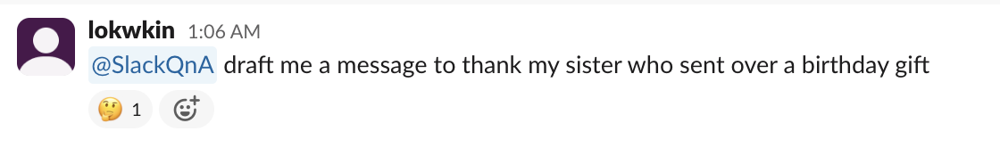
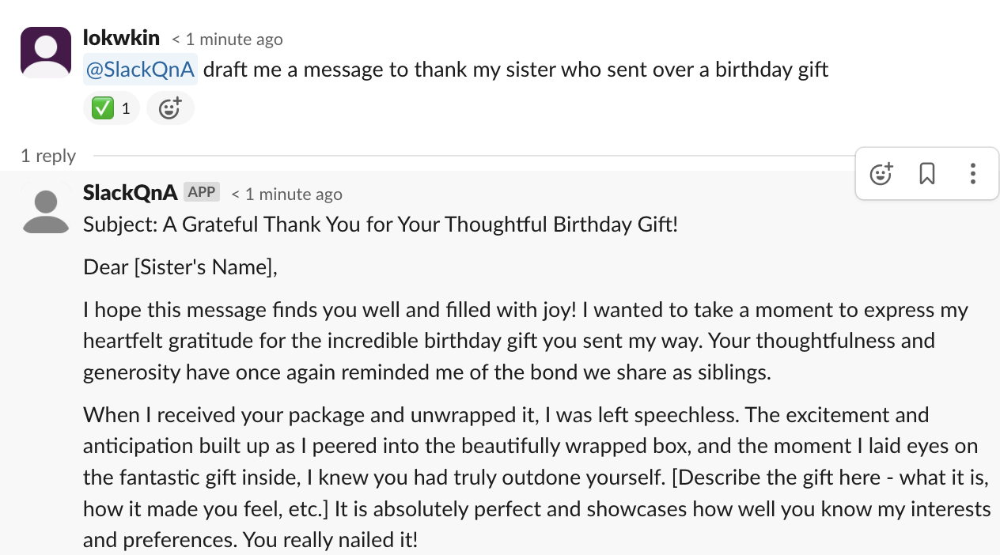
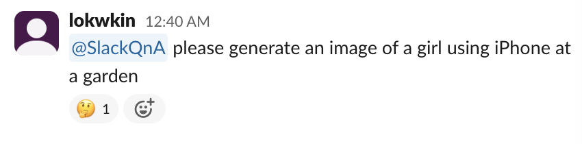
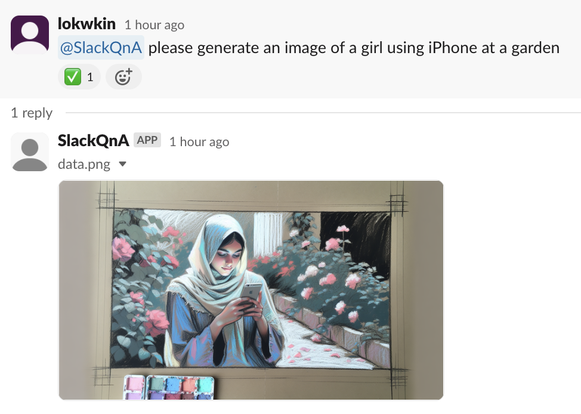

# Slack Q&A

An easy plug-and-use library for developing Slack BOT that serves a Q&A-like use case.

For Python version, please see https://github.com/lokwkin/slack-qna-python

## Description

High level flow:
1. User messages this BOT via either:
    1. Direct Message
    2. Mention in Channel
    3. Slack Command
2. The BOT shows a loading reaction to the message.
3. The BOT relays user's message to your custom handler, and expect for a result either in `Text`, `File` or `Image` type.
4. The BOT reply the user's message in Slack Thread.
5. The BOT also shows a success reaction to the message.

Note:
- This BOT uses Slack's Socket Mode instead of Webhook mode for slack connection, so it does not require an exposed public endpoint. But your services need to be long running.

## Sample use cases

#### Use with ChatGPT (Text Response)



#### Use with Dall-E (Image Response)




## Usage

### Install
```
npm install --save slack-qna-node
```

```js
import { SlackQna, IncomingMessage } from 'slack-qna-node';

const slackQnABot = new SlackQna({_
    slackBotToken: '<SLACK_BOT_TOKEN>',
    slackAppToken: '<SLACK_APP_TOKEN>',
    botUserId: '<SLACK_BOT_USER_ID>'
});

slackQnABot.registerHandler({
  isSync: true,         // If isSync = true, it would reply the user with the handler function result.
                        // If isSync = false, you would need to call slackQnABot.postMessage(OutgoingMessage) on your own.
  dataType: 'image',    // Expected output. Can either be "text", "file" or "image"
  handler: async (message: IncomingMessage) => {
    // Your logic goes here.
    return 'Hi there';
  },
});

slackAdapter.listen({
  directMessage: true,
  mention: true,
  command: true
});
```

### Slack Setup
1. Register an Slack App in portal https://api.slack.com/
2. "Socket Mode" -> Enable Socket Mode
3. "OAuth & Permissions" -> "Bot Token Scopes" -> Grant these permissions: `app_mentions:read`, `channels:history`, `chat:write`, `im:history`, `im:write`, `reactions:write`, `groups:history`, `files:write`
4. "Event Subscription" -> "Enable Event" -> "Subscribe to bot events" -> Add `message.im` and `app_mention` --> "save"
5. "App Home" -> "Message Tab" -> Enable "Allow users to send Slash commands and messages from the messages tab"
6. Install bot to your workspace
7. Obtain your Bot Token from "OAuth & Permissions" > "Bot User OAuth Token"
8. Obtain your App Token from "Basic Information" > "App Level Token"
9. "Install App" -> Reinstall to workspace if neccessary